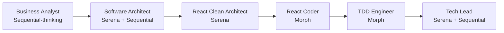
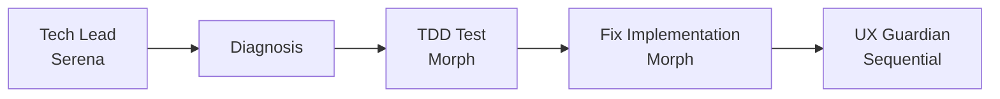
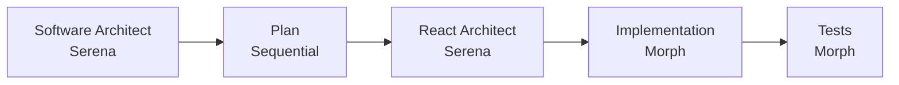

# MCP Integration Strategy

## Overview

This document outlines the strategic integration of Model Context Protocol (MCP) tools into our agent workflow, following Anthropic's best practices for multi-agent systems. Each MCP is assigned to specific agents based on role specialization and capability alignment.

## Core MCPs

### 1. Serena MCP - Semantic Code Understanding

**Purpose:** Provides semantic code navigation through Language Server Protocol (LSP)

**Key Capabilities:**

- `find_symbol` - Navigate to specific classes, methods, functions
- `find_referencing_symbols` - Understand impact analysis
- `get_symbols_overview` - Quick file structure understanding
- `replace_symbol_body` - Precise refactoring at symbol boundaries

**Assigned Agents:**

- **@agent-software-architect** - System-wide architecture understanding
- **@agent-react-clean-architect** - React component hierarchy navigation
- **@agent-tech-lead-reviewer** - Comprehensive code reviews
- **@agent-database-architect** - Repository pattern understanding

### 2. Morph MCP - Intelligent Code Editing

**Purpose:** Fast Apply for intelligent code merging (4,500+ tokens/second)

**Key Capabilities:**

- Rapid code merging without conflicts
- Intelligent context preservation
- Multi-file batch editing
- Preview mode with `dryRun`

**Assigned Agents:**

- **@agent-react-coder** - React component implementation
- **@agent-api-standards-expert** - Hono endpoint creation
- **@agent-tdd-test-engineer** - Test suite creation
- **@agent-database-architect** - Migration file updates

### 3. Sequential-Thinking MCP - Complex Reasoning

**Purpose:** Structured problem-solving with branching thoughts

**Key Capabilities:**

- Hypothesis generation and validation
- Branching exploration of alternatives
- Systematic decision trees
- Backtracking and revision support

**Assigned Agents:**

- **@agent-business-analyst** - Requirement decomposition
- **@agent-software-architect** - Architectural decisions
- **@agent-tech-lead-reviewer** - Multi-dimensional analysis
- **@agent-ux-guardian** - Test scenario generation

## Integration Patterns

### Pattern 1: Code Understanding → Edit → Verify

```
1. Serena: Find and understand symbols
2. Morph: Make intelligent edits
3. Sequential-thinking: Verify completeness
```

**Example Workflow:**

- Tech Lead uses Serena to understand code structure
- React Coder uses Morph to implement changes
- Tech Lead uses Sequential-thinking to verify all cases covered

### Pattern 2: Requirement → Architecture → Implementation

```
1. Sequential-thinking: Decompose requirements
2. Serena: Map to existing code structure
3. Morph: Implement changes efficiently
```

**Example Workflow:**

- Business Analyst uses Sequential-thinking for requirements
- Software Architect uses Serena to check existing patterns
- API Designer uses Morph to implement endpoints

### Pattern 3: Review → Refactor → Test

```
1. Serena: Identify code smells via symbol analysis
2. Sequential-thinking: Plan refactoring strategy
3. Morph: Execute refactoring
4. Serena: Verify reference updates
```

**Example Workflow:**

- Tech Lead uses Serena for code review
- Software Architect uses Sequential-thinking for refactor plan
- React Coder uses Morph to refactor components
- TDD Engineer verifies with tests

## Workflow Optimizations

### Feature Development Flow



### Bug Fix Flow



### Refactoring Flow



## Token Optimization Strategies

### Serena Usage

- **Cache symbol overviews** at conversation start
- **Use `depth=0`** initially, increase only when needed
- **Prefer `find_symbol`** over `read_file` for large files
- **Batch symbol lookups** when analyzing multiple components

### Morph Usage

- **Batch multiple edits** in single operations
- **Use Fast Apply mode** for files > 1000 lines
- **Preview with `dryRun`** for complex changes
- **Leverage intelligent merge** for conflict resolution

### Sequential-Thinking Usage

- **Set appropriate `total_thoughts`** limits (typically 5-10)
- **Use branching sparingly** for critical decisions only
- **Implement early termination** when solution is found
- **Avoid for simple, linear problems**

## Performance Metrics

### Key Performance Indicators

- **Code Understanding Speed**: Time to navigate to relevant code (Target: <5s)
- **Edit Accuracy**: Successful edits without conflicts (Target: >95%)
- **Problem Solution Quality**: Completeness of analysis (Target: >90%)
- **Token Efficiency**: Tokens per task completion (Target: <50% reduction)
- **Agent Handoff Success**: Clean context transfer (Target: 100%)

### Monitoring Points

1. **Serena Performance**

   - Symbol resolution time
   - Cache hit rate
   - Context window usage

2. **Morph Performance**

   - Merge success rate
   - Edit speed (tokens/second)
   - Conflict resolution rate

3. **Sequential-Thinking Performance**
   - Average thoughts per problem
   - Branch utilization
   - Solution quality score

## Risk Mitigation

### Serena Risks

**Risk:** Large codebases may exceed context
**Mitigation:**

- Use targeted symbol searches
- Implement progressive disclosure
- Cache frequently accessed symbols

### Morph Risks

**Risk:** Potential for unintended edits
**Mitigation:**

- Always preview with `dryRun` first
- Implement rollback capability
- Use version control checkpoints

### Sequential-Thinking Risks

**Risk:** Token consumption with deep reasoning
**Mitigation:**

- Set strict thought limits
- Use for complex tasks only
- Implement cost monitoring

## Agent Standardization Impact on MCP Usage

### Unified Documentation Structure

All agents now include standardized MCP sections:

1. **Tools You Must Use** - Explicit MCP tool requirements
2. **Research Protocol** - Step-by-step MCP usage workflows
3. **Integration Patterns** - How MCPs facilitate agent collaboration

This standardization improves:

- **Tool Discovery**: Agents know exactly which MCPs to use
- **Workflow Consistency**: Similar tasks use similar MCP patterns
- **Handoff Efficiency**: Clear MCP context passing between agents
- **Error Reduction**: Explicit protocols reduce misuse of MCPs

### Enhanced MCP Distribution

| MCP Tool                | Primary Agents                                                         | Secondary Agents             |
| ----------------------- | ---------------------------------------------------------------------- | ---------------------------- |
| **context7**            | React Coder, API Expert, Database Architect, Biome Lint, TypeScript Diag | All development agents       |
| **perplexity**          | Business Analyst, Domain Validator, Product Manager, Biome Lint, TypeScript Diag | All research-heavy agents    |
| **Serena**              | Software Architect, Tech Lead, React Clean Architect                  | All code navigation agents   |
| **Morph**               | React Coder, API Expert, TDD Engineer, Biome Lint, TypeScript Diag    | All code-writing agents      |
| **Sequential-thinking** | Business Analyst, Software Architect, UX Guardian                     | All complex reasoning agents |
| **Playwright**          | Design Review, UX Guardian                                            | Testing agents               |
| **Firecrawl**           | Product Manager, UX Designer                                          | Research agents              |
| **Zen tools**           | Tech Lead, Software Architect, Domain Validator, Biome Lint, TypeScript Diag | Decision-making agents       |

## Implementation Phases

### Phase 1: Core Integration (Completed)

✅ Add Serena to architecture and review agents
✅ Add Morph to code-writing agents
✅ Add Sequential-thinking to planning agents
✅ Standardize all agent documentation with MCP sections
✅ Create detailed "Integration with Other Agents" sections
✅ Add "Research Protocol" to guide MCP usage

### Phase 2: Optimization (Completed)

✅ Create agent coordination rules for MCP handoffs
✅ Establish clear MCP usage patterns per agent role
✅ Implement standardized research protocols

### Phase 3: Advanced Patterns (Future)

- [ ] Multi-agent MCP sharing (pass Serena context)
- [ ] Parallel MCP execution for complex tasks
- [ ] MCP result aggregation and synthesis

## Command Patterns

### Command Types After Standardization

All commands now use YAML headers with:
- `name`: Command identifier
- `description`: Purpose statement
- `model`: Recommended model (sonnet/opus)
- `agents`: List of agents involved
- `color`: Visual identifier

1. **Simple Dispatchers** - Single agent delegation
   - `/fix:lint` → `@agent-biome-lint-fixer`
   - `/fix:types` → `@agent-typescript-diagnostics-fixer`
   - `/fix:tests` → `@agent-tdd-test-engineer`
   - `/analyze` → `@agent-task-analyzer`
   - `/implement` → `@agent-task-implementation-orchestrator`

2. **Orchestrators** - Multi-agent coordination
   - `/design:review` → `@agent-git-workflow` + `@agent-design-review`
   - `/feature:discovery` → 4 agents (business-analyst leads)
   - `/feature:prd` → 7 agents (product-manager-prd leads)
   - `/feature:techspec` → 7 agents (software-architect leads)
   - `/feature:tasks` → 5 agents (tech-lead-reviewer leads)

3. **Workflow Commands** - Complete lifecycle management
   - `/feature:workflow` → Orchestrates all feature phases sequentially
   - Git commands (`/git:*`) → All delegate to `@agent-git-workflow`

This standardization ensures commands follow KISS principle while agents handle complexity.

## Best Practices

### General Guidelines

1. **Choose the right tool** - Don't use Sequential-thinking for simple tasks
2. **Cache aggressively** - Especially Serena symbol maps
3. **Batch operations** - Multiple edits with Morph
4. **Preview changes** - Always use dryRun with Morph
5. **Set limits** - Thought limits for Sequential-thinking
6. **Commands delegate, agents execute** - Keep commands simple

### Agent-Specific Guidelines

#### For Architects (Serena + Sequential)

- Start with Serena overview before deep analysis
- Use Sequential-thinking for trade-off decisions
- Cache architectural patterns for reuse

#### For Coders (Morph)

- Batch related changes together
- Use Fast Apply for large files
- Preview complex refactoring

#### For Analysts (Sequential)

- Set appropriate thought depth
- Use branching for critical decisions
- Document decision rationale

## Success Metrics

### Short-term (1 month)

- 50% reduction in code navigation time
- 30% improvement in edit accuracy
- 25% reduction in token usage

### Medium-term (3 months)

- 70% of refactoring automated
- 90% test coverage on new features
- 40% faster feature delivery

### Long-term (6 months)

- Near-zero merge conflicts
- Complete architectural documentation
- 50% reduction in bug introduction rate

## Key Improvements from Standardization

### Before Standardization

- Inconsistent agent documentation
- Unclear MCP tool assignments
- Ambiguous collaboration patterns
- Missing research protocols

### After Standardization

- **100% Coverage**: All 15 agents have complete MCP sections
- **Explicit Protocols**: Every agent has a clear research workflow
- **Detailed Integration**: 4+ specific contexts per agent collaboration
- **Consistent Philosophy**: Every agent has a "Remember" principle

### Measurable Benefits

1. **Reduced Ambiguity**:

   - From "collaborate with tech-lead" to "collaborate for code review on query optimization, index validation, migration analysis, performance benchmarking"

2. **Faster Onboarding**:

   - New developers immediately understand which tools each agent uses
   - Clear research protocols eliminate guesswork

3. **Better MCP Utilization**:

   - Agents now explicitly list required MCPs
   - Research protocols guide step-by-step MCP usage

4. **Improved Multi-Agent Workflows**:
   - Detailed integration sections reduce handoff friction
   - Specific contexts ensure relevant information transfer

## Conclusion

The integration of Serena, Morph, and Sequential-thinking MCPs, combined with comprehensive agent standardization, represents a significant enhancement to our development workflow. By following Anthropic's principles of modular decomposition and role-specific tooling, we've created a system where:

1. **Each agent has precisely the tools needed** for their specialization
2. **Workflows are predictable and consistent** across all agents
3. **Collaboration patterns are explicit** with detailed contexts
4. **Research protocols guide investigation** systematically

This strategic alignment enables:

- **Faster code understanding** through semantic navigation with Serena
- **Safer code changes** through intelligent merging with Morph
- **Better decision-making** through structured reasoning with Sequential-thinking
- **Improved collaboration** through standardized integration patterns
- **Reduced errors** through explicit research protocols

The key to success is using each MCP for its intended purpose, following the standardized documentation structure, and leveraging the detailed integration patterns for smooth multi-agent workflows. With this comprehensive standardization, our agents work together as a cohesive system rather than isolated tools.
