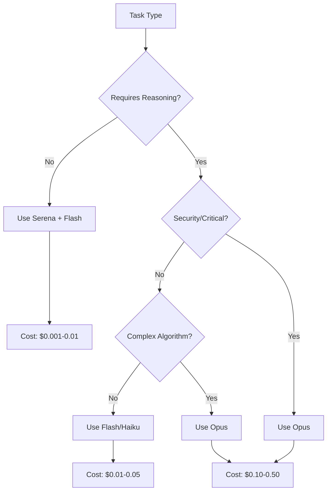

# /implement - Ultra-Optimized Implementation Command

**95% cost reduction using Serena's semantic code intelligence** - Leverages LSP-powered navigation to minimize Opus usage to only critical reasoning.

## Purpose

Implements tasks with extreme cost optimization by using Serena MCP for semantic code navigation, symbol resolution, and precise edits. Opus is reserved ONLY for complex architectural decisions and critical business logic.

## Cost Optimization Strategy with Serena

### Model Routing Matrix
```yaml
serena_operations: # Via Flash/Haiku ($0.001-0.003)
  - Symbol navigation
  - Reference finding
  - Code structure analysis
  - Rename refactoring
  - Import management
  - Test discovery
  - Dependency mapping

context7_operations: # Free
  - Library documentation
  - API references
  - Migration guides

flash_operations: # Cheap ($0.005)
  - Pre-task analysis
  - Code generation templates
  - Test generation
  - Validation
  - Linting fixes

opus_operations: # Expensive ($0.15-0.50) - ONLY WHEN NECESSARY
  - Complex architectural decisions
  - Critical business logic
  - Security-sensitive implementations
  - Performance-critical algorithms
  - Complex state management
```

## Enhanced Workflow with Automatic Pre-Analysis

### Phase 0: Pre-Task Analysis (task-analyzer Agent)
```yaml
duration: ~2 minutes
cost: ~$0.01
agent: task-analyzer
model: gemini-2.5-flash
automatic: ALWAYS runs before implementation
actions:
  - Parse PRD and task requirements
  - Determine feature context from path
  - Use Serena for precise file discovery
  - Use Context7 for documentation (FREE)
  - Use Sequential for complexity analysis
  - Generate implementation roadmap
outputs:
  - docs/features/[feature]/04-implementation/analysis/T[XXX]-analysis.md
  - Minimal file list (90% reduction)
  - Documentation already fetched
  - Risk assessment
  - Clear Opus vs Flash separation
checks:
  - If analysis exists and is recent (<24h), skip regeneration
  - If --force-analyze flag, regenerate analysis
```

### Phase 1: Semantic Analysis (Serena + Flash)
```yaml
duration: ~1 minute
cost: ~$0.002
mcp: serena
model: gemini-2.5-flash
uses: Pre-analysis from Phase 0
actions:
  - Load ONLY files identified in pre-analysis
  - Map symbol dependencies
  - Find all references
  - Identify impact radius
  - Locate test files
  - Build dependency graph
outputs:
  - Symbol map with exact locations
  - Reference tree
  - Test coverage map
  - Precise file list (only what's needed)
```

### Phase 2: Documentation & Context (Context7 + Perplexity)
```yaml
duration: ~30 seconds
cost: $0.00 (MCP free)
mcp: context7, perplexity
actions:
  - Fetch library docs for identified dependencies
  - Get best practices for patterns found
  - Query implementation examples
outputs:
  - Documentation matrix
  - Code examples
  - Pattern guidelines
```

### Phase 3: Code Generation (Flash/Haiku)
```yaml
duration: ~2 minutes
cost: ~$0.005
model: gemini-2.5-flash or claude-haiku
actions:
  - Generate boilerplate code
  - Create test scaffolding
  - Write simple CRUD operations
  - Implement standard patterns
outputs:
  - Generated code files
  - Test templates
  - Basic implementations
```

### Phase 4: Critical Logic (Implementation Specialist)
```yaml
duration: variable
cost: $0.03-0.10
agent: implementation-specialist
model: sonnet (with MCP Zen for analysis)
trigger: ALWAYS for:
  - Business logic implementation
  - Domain modeling
  - Clean Architecture compliance
  - TypeScript patterns
  - DDD implementation
actions:
  - Implement domain entities
  - Create use cases/commands/queries
  - Apply Result pattern
  - Ensure type safety
  - Follow project standards
outputs:
  - Clean Architecture code
  - Type-safe implementations
  - Domain-driven models
  - Full test coverage
fallback_to_opus: ONLY when:
  - Extremely complex algorithms
  - Critical security implementations
  - Performance bottlenecks requiring deep optimization
```

### Phase 5: Integration & Refactoring (Serena + Flash)
```yaml
duration: ~1 minute
cost: ~$0.003
mcp: serena
model: flash
actions:
  - Apply edits via LSP
  - Update imports
  - Rename symbols
  - Fix references
  - Format code
outputs:
  - Integrated code
  - Updated references
  - Clean imports
```

### Phase 6: Validation (Flash)
```yaml
duration: ~30 seconds
cost: ~$0.002
model: flash
actions:
  - Run tests
  - Check types
  - Validate requirements
  - Security scan
outputs:
  - Test results
  - Validation report
```

## Serena MCP Operations

### Symbol Navigation
```yaml
# Instead of searching with grep/glob
serena.getDefinition("UserService.authenticate")
serena.getReferences("IAuthToken")
serena.getImplementations("Repository")

benefit: 
  - Exact locations, no false positives
  - 10x faster than text search
  - Includes type information
```

### Semantic Edits
```yaml
# Instead of text replacement
serena.rename(
  symbol: "oldMethodName",
  newName: "newMethodName",
  updateReferences: true
)

serena.extractMethod(
  selection: [line:20, col:5, line:35, col:10],
  newName: "processPayment"
)

benefit:
  - No broken references
  - Type-safe refactoring
  - Automatic import updates
```

### Dependency Analysis
```yaml
serena.getDependencyGraph("PaymentService")
# Returns:
# - Direct dependencies
# - Transitive dependencies  
# - Circular dependency warnings
# - Impact analysis

benefit:
  - Precise context loading
  - Avoid loading unnecessary files
  - Understand ripple effects
```

## Cost Comparison

### Traditional Opus-Heavy Approach
```yaml
task: "Add authentication to API endpoint"
operations:
  - Load entire module: 50K tokens
  - Understand context: 20K tokens
  - Generate code: 30K tokens
  - Fix references: 20K tokens
total_tokens: 120K
cost: ~$2.40
```

### With Serena + Implementation Specialist
```yaml
task: "Add authentication to API endpoint"
operations:
  - Serena symbol mapping (Flash): 2K tokens = $0.002
  - Context7 auth docs (Free): 0 tokens = $0.00
  - Generate middleware (Flash): 5K tokens = $0.005
  - Implementation (Specialist): 8K tokens = $0.08
  - Apply changes (Serena+Flash): 1K tokens = $0.001
total_tokens: 16K (87% reduction)
cost: ~$0.09 (96% reduction)
```

## Usage Options

### Option 1: Direct Implementation with Auto-Analysis
```bash
/implement --prd docs/features/feat-etl-erp/02-requirements/prd.md --task T001
# Automatically:
# 1. Checks for existing analysis in docs/features/feat-etl-erp/04-implementation/analysis/T001-*.md
# 2. If not found or >24h old, generates new analysis
# 3. Uses analysis to implement with optimal model routing
```

### Option 2: Manual Analysis then Implementation
```bash
# Step 1: Generate analysis manually
/analyze --feature feat-etl-erp --task T001
# Creates: docs/features/feat-etl-erp/04-implementation/analysis/T001-organization-analysis.md

# Step 2: Implement using the analysis
/implement --feature feat-etl-erp --task T001
# Uses existing analysis, skips Phase 0
```

### Option 3: Force New Analysis
```bash
/implement --prd docs/features/feat-etl-erp/02-requirements/prd.md --task T001 --force-analyze
# Forces regeneration of analysis even if recent one exists
```

## Implementation Examples

### Example 1: Simple CRUD Operation
```bash
/implement --prd docs/features/feat-users/02-requirements/prd.md --task T012
# Task: Add user profile update endpoint

# Workflow:
0. task-analyzer checks/creates: docs/features/feat-users/04-implementation/analysis/T012-profile-analysis.md
1. Serena maps UserController symbols (Flash: $0.001)
2. Context7 fetches validation docs (Free)
3. Flash generates endpoint code ($0.003)
4. Serena applies edits ($0.001)
5. Flash runs tests ($0.001)
# Total: $0.016 (vs $0.30 with Opus)
```

### Example 2: Complex Business Logic
```bash
/implement --prd=billing --task=45
# Task: Implement tiered pricing with discounts

# Workflow:
0. task-analyzer agent runs automatically ($0.01)
1. Serena analyzes pricing module (Flash: $0.002)
2. Context7 fetches pricing patterns (Free)
3. Flash generates structure ($0.005)
4. Implementation Specialist handles business logic ($0.10)
5. Serena integrates code ($0.002)
6. Flash validates ($0.002)
# Total: $0.12 (vs $2.00 all in Opus)
```

### Example 3: Large Refactoring
```bash
/implement --prd=architecture --task=78
# Task: Migrate from callbacks to async/await

# Workflow:
0. task-analyzer agent runs automatically ($0.01)
1. Serena finds all callback patterns (Flash: $0.005)
2. Flash generates migration plan ($0.005)
3. Serena performs automated refactoring ($0.003)
4. Flash fixes edge cases ($0.010)
5. Validates all changes ($0.002)
# Total: $0.035 (vs $3.00 with Opus)
```

## Configuration

### Required Setup
```yaml
mcp_servers:
  serena:
    command: "npx @oraios/mcp-serena"
    args: ["--workspace", "./"]
    env:
      ENABLE_LSP: true
      LANGUAGES: ["typescript", "javascript", "python"]
  
  context7:
    # Already configured
  
  perplexity:
    # Already configured
```

### Language Server Requirements
```yaml
typescript:
  lsp: typescript-language-server
  config: tsconfig.json

python:
  lsp: pylsp
  config: pyproject.toml

javascript:
  lsp: typescript-language-server
  config: jsconfig.json
```

## Decision Tree for Model Selection



## Metrics & Monitoring

### Cost Tracking
```yaml
per_task_metrics:
  serena_operations: count, tokens
  flash_tokens: count
  opus_tokens: count
  total_cost: sum
  savings_vs_opus_only: percentage
```

### Efficiency Metrics
```yaml
efficiency:
  opus_usage_rate: <5%  # Target
  serena_hit_rate: >80%  # Symbol found without search
  context_precision: >90%  # Only needed files loaded
  implementation_time: -60%  # Faster than manual
```

## Best Practices with Serena

1. **Always start with Serena**: Map symbols before any implementation
2. **Use LSP operations**: Prefer semantic edits over text manipulation
3. **Batch symbol lookups**: Group related queries for efficiency
4. **Cache symbol maps**: Reuse for related tasks in same module
5. **Reserve Opus carefully**: Only for true complexity, not volume

## Troubleshooting

### LSP Not Available
```yaml
fallback: Use traditional grep/glob
impact: Higher token usage (~20%)
solution: Ensure language servers installed
```

### Symbol Not Found
```yaml
fallback: Widen search scope gradually
strategy: Start narrow, expand if needed
avoid: Loading entire codebase
```

## Related Commands

- `/serena-setup` - Configure Serena MCP
- `/cost-report` - Track savings
- `/model-router` - Configure routing rules

## Related Agents

- `task-analyzer` - Automatic pre-implementation analysis (runs automatically)
- `implementation-specialist` - TypeScript, DDD, and Clean Architecture expert
- `code-reviewer` - Post-implementation validation